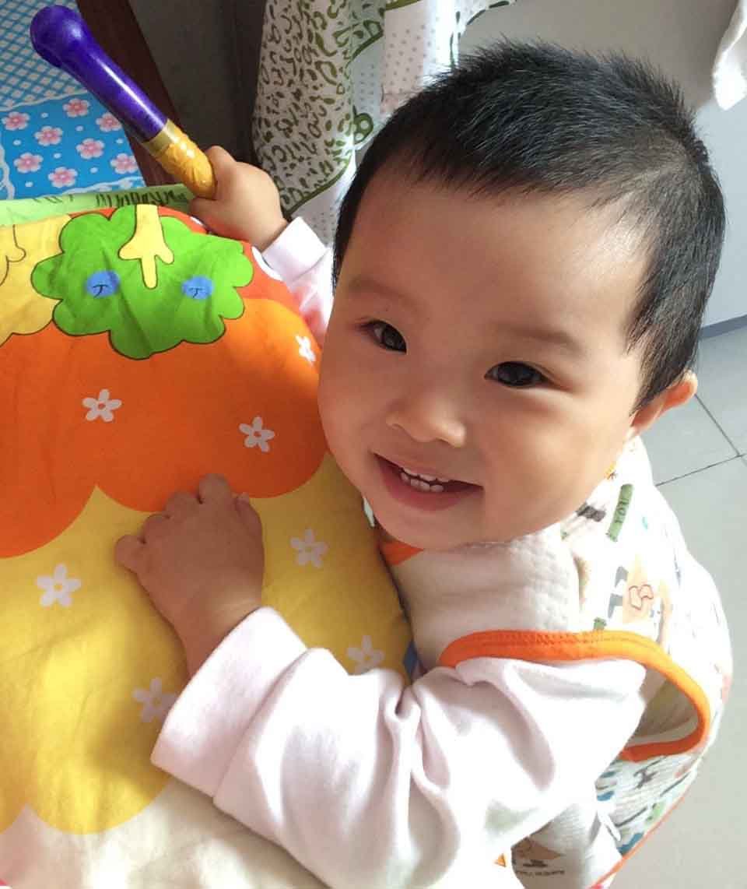

## 这是个记录嘉嘉的博客
----

2014年7月14日，女儿嘉嘉出生。

每个攻城狮都应该有一个自己的技术博客，但我还要分享生活

仅以此博客来记录女儿的点点滴滴的。

## 博客中的技术类型
---

-   iOS 
-	web前端
-   蓝牙开发
-   java少量
-   C# .net 会写一些
-   其他（数据库，网站部署，博客建站seo优化，个人生活等会少量涉及）

平时我也会整理一些开发中遇到的问题，在2015年终于完成了基本的整理并放在了github上，目前分了2个repo

-	[dev-tips](https://github.com/coolnameismy/dev-tips)
-	[ios-tips](https://github.com/coolnameismy/ios-tips)

## 博客更新频率
---

之前每周一篇，来到阿里后平时工作比较忙，所以现在也只能保证一月一篇。

## 博客中示例程序代码下载：
---

-	[ios demo](https://github.com/coolnameismy/demo)
-	[web demo](https://github.com/coolnameismy/demo-web)

## 最后
---

这个博客通过 [Jekyll](http://jekyllrb.com/) 生成，博客的源码托管在[Github](https://github.com/coolnameismy/coolnameismy.github.io)上，如果你也想拥有一个一样的Blog，可以直接在github上fork这个项目，教程可以见[在Github上搭建Jekyll博客和创建主题](http://liuyanwei.jumppo.com/2014/02/12/how-to-deploy-a-blog-on-github-by-jekyll.html)

如果有问题可以直接评论,或是给我发邮件。除此之外可以通过RRS订阅blog的更新，点击左下角两个图标即可。如果觉得对你有所帮助，就给我点个赞或是[github上follow](https://github.com/coolnameismy/)。谢谢大家的支持。